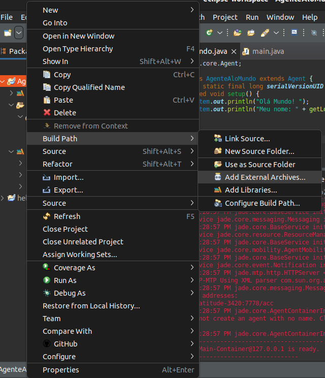

# Instalação

A instalação do framework **JADE** foi realizada a partir das informações disponíveis no site oficial, com apoio de professores, colegas de projeto e por meio de experimentações.  
Para auxiliar futuros usuários, este guia descreve o processo de instalação e configuração do JADE, incluindo testes em diferentes IDEs (Eclipse e IntelliJ) e ambientes (Linux e Windows).

Durante os testes, também foram avaliadas alternativas com o **Maven**, porém, optou-se pela adição manual das bibliotecas externas, por maior controle e simplicidade.  

**Recomendação**: utilize a versão completa do JADE (com exemplos) fornecida pelo próprio site.


## Pré-requisitos
- **JDK do Java** instalado (recomendado a versão mais recente compatível).
- **IDE**: Eclipse ou IntelliJ IDEA.

## Instalação
1. Acesse o [site oficial do JADE](https://jade.tilab.com/download/jade/?page_id=790) e baixe o arquivo **JADE-all-x.x.x.zip**.
2. Mova o arquivo `.zip` para a pasta raiz do seu ambiente de desenvolvimento.
3. No terminal, descompacte os arquivos usando o comando `jar xvf` (para evitar incompatibilidades):
    ```bash
    jar xvf JADE-all-x.x.x.zip
    jar xvf JADE-bin-x.x.x.zip
    jar xvf JADE-src-x.x.x.zip
    jar xvf JADE-examples-x.x.x.zip
    jar xvf JADE-doc-x.x.x.zip
    ```
   Substitua x.x.x pela versão específica do JADE baixada.
4. Após a descompactação, será criada a pasta jade/ com a seguinte estrutura:
```
/jade
├ classes
├ demo
├ doc
├ lib
│   ├ commons-codec
│   │   └ commons-codec-1.3.jar
│   ├ jade.jar
│   └ jadeExamples.jar
├ src
├ build.properties
├ build.xml
├ License
└ README

```
## Configuração de Ambiente
### Linux (Ubuntu)
1. Abra o arquivo `.bashrc`:
```bash
  sudo nano ~/.bashrc
```
2. Adicione as as variáveis de ambiente ao final do arquivo:

```bash
# JADE
    export JADE_LIB=/home/{SEU-USUARIO}/jade/lib
    export JADE_CP=$JADE_LIB/jade.jar:$JADE_LIB/jadeExamples.jar:$JADE_LIB/commons-codec/commons-codec-1.3.jar
    alias rJade='java -cp $JADE_CP jade.Boot -gui'
    alias cJade='javac -cp $JADE_CP'
```
Troque `{SEU-USUARIO}` pelo nome do seu usuário no sistema.

3. Salve e recarregue as configurações:
```bash
  source ~/.bashrc
```

4. Reinicie o sistema para garantir que tudo seja aplicado:
```bash
  reboot
```

### Windows (via Variáveis de Ambiente)

Acesse o menu Iniciar → pesquise por Variáveis de Ambiente.

1. Clique em Editar variáveis de ambiente do sistema. 
2. Em Variáveis do usuário adicione:
3. JADE_LIB → caminho para a pasta `jade/lib`
4. JADE_CP → `%JADE_LIB%\jade.jar;%JADE_LIB%\jadeExamples.jar;%JADE_LIB%\commons-codec\commons-codec-1.3.jar` 
5. Crie atalhos semelhantes aos aliases no Prompt de Comando ou configure diretamente na IDE.

## Teste de Instalação

No terminal execute:
```bash
  rJade
```

Se tudo estiver correto, a interface do JADE será exibida.


## Criando o Agente "Olá Mundo"

1. Criar Projeto
- Crie um projeto Java chamado AgenteAloMundo. 
- Adicione a seguinte classe:

```java
    import jade.core.Agent;
    
    public class AgenteAloMundo extends Agent {
        private static final long serialVersionUID = 1L;
        protected void setup() {
            System.out.println("Olá Mundo! ");
            System.out.println("Meu nome: " + getLocalName());
        }
    }
```

2. Adicionar Bibliotecas Externas
- Eclipse → `Build Path` > `Add External Archives` → selecione `jade.jar`, `jadeExamples.jar` e `commons-codec-1.3.jar`.
  
- IntelliJ → `File` > `Project Structure` > `Libraries` → adicione os mesmos arquivos `.jar`.

3. Configurar Execução

- Acesse as configuracoes de execucao do projeto (edit ou run configuration).
- Inclua as informacoes do projeto:

    - **Name:** `AgenteAloMundo`
    - **Project:** `AgenteAloMundo`
    - **Main class:** `jade.Boot`

     
    

- Defina os argumentos a serem passados na aba `Arguments`
    ``` bash
        -gui -local-host 127.0.0.1 -local-port 8083 customAgent:AgenteAloMundo
    ```
    - `-gui`: para abrir a interface gráfica do jade
    - `-local-host`: é preciso definir o localhost
    - `-loal-port`: é preciso definir uma porta
    - `customAgent`: nome a desejar do agente que será executado/criado
    - `AgenteAloMundo`: classe do agente
- Aplique as alteracoes e rode o projeto.

- Resultado esperado:

    